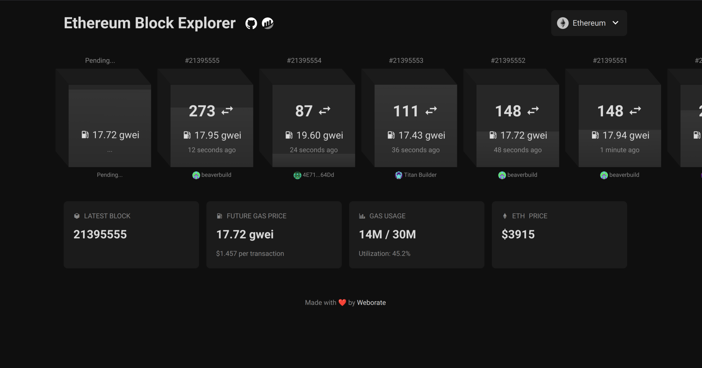

# EVM Block Explorer

https://explorer.coolhd.hu

EVM Block Explorer is visualization tool for exploring EVM blockchains, inspired by [Mempool Space](https://mempool.space).

## Preview



## Prerequisites

- Docker
- Docker Compose

## Getting Started

1. Clone the repository:

``` bash
git clone https://github.com/DaWe35/HyperSound-Blocks.git
cd HyperSound-Blocks
```

2. Start the application using Docker Compose:

```bash
docker compose up -d
```

3. Access the application at `http://localhost:9999`
